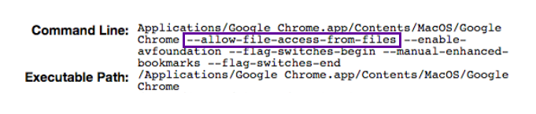

#Start Chrome with Flags (Mac)

When using the [Sinch Javascript SDK](https://www.sinch.com/docs/javascript/user-guide/) locally in Chrome, it is necessary to start Chrome with the flag `--allow-file-access-from-files`.

1. Find the path to Chrome on your computer by opening [chrome://version](chrome://version/). Look for **Executable Path**. Copy that path.
2. Quit Chrome! Don't just close your open tabs, **quit!**
3. From your terminal, run `$ YOUR_EXECUTABLE_PATH --allow-file-access-from-files`
4. Chrome should launch now. Navigate back to [chrome://version](chrome://version/) to see that the flag has been added properly

    

5. To quit, **crtl-c** in the terminal tab that is running Chrome.